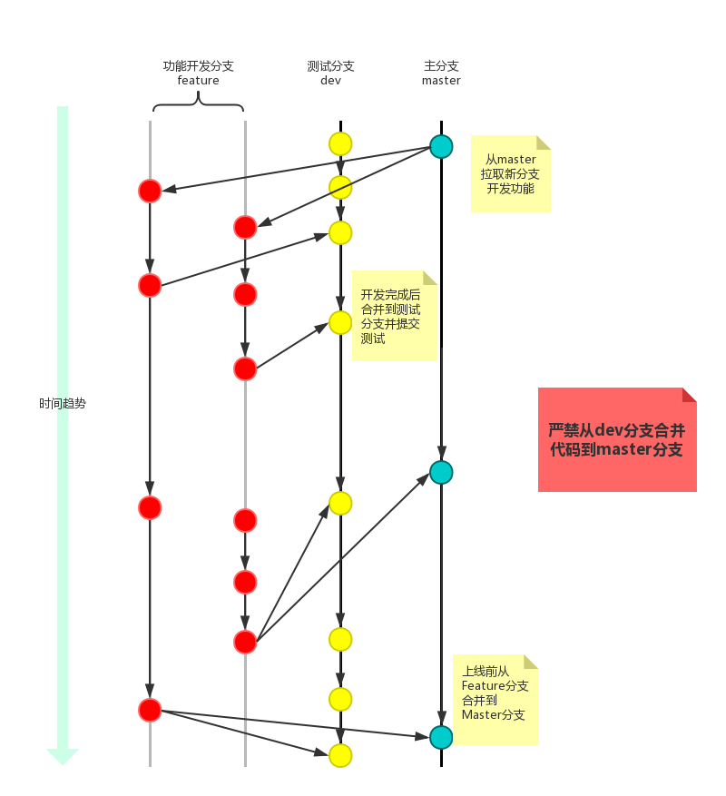

在开工之前，我们约定一下git的开发流程，详细的可以参考这篇文章:
https://blog.csdn.net/u012562943/article/details/79754587

基本原则：

1 分支解释：

- master 是受保护的分支，今后是稳定版本，用于build和线上部署，是稳定分支，不可以push。只有当代码经过验证以后，负责人才可以合并到该分支；

- dev 分支是大家可以进行开发集成和测试的分支，原则上接受pull和push，本次大家都在 dev 分支上开发；

2 需要开发一个 feature 或者版本的时候，从master中创建一个分支出来，在本地进行开发，开发完毕后合并到测试（dev）分支进行验证，验证通过后才可以合并到master进行上线；

  大体步骤：

  - 创建项目
  - 从 master 分支上开出若干环境分支，如：dev(对应测试环境), sim, online
  - 开始一个任务的 时候从gitlab界面上开feature分支(create from master), 命名规范建议是feature/jira-123
  - 在开发者本机执 行: git fetch
  - 在开发者本机执 行: git checkout origin feature/xxxx
  - 提交代码: git commit ...
  - 测试验证 feature 分支是否正常；
  - 推送 feature 分支：git push origin feature/xxxx
  - 在 GOGS 界面上合并 feature 分支到对应的环境分支

  注意：

  - 从 master 分支开出分支，以及合并到master这个过程建议在GOGS界面上面来做，而不是在命令行中；
  - 本次本着迅速开发原则，dev 分支是一个初始分支，大家可以直接pull和push；但为了保证不相互冲突，鼓励大家创建自己的 feature 分支；
